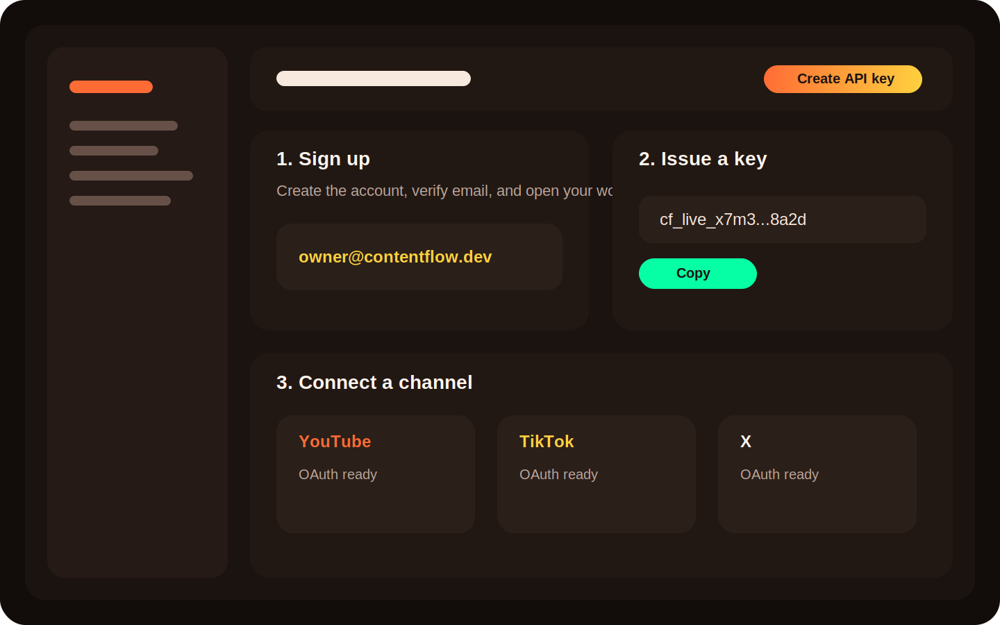
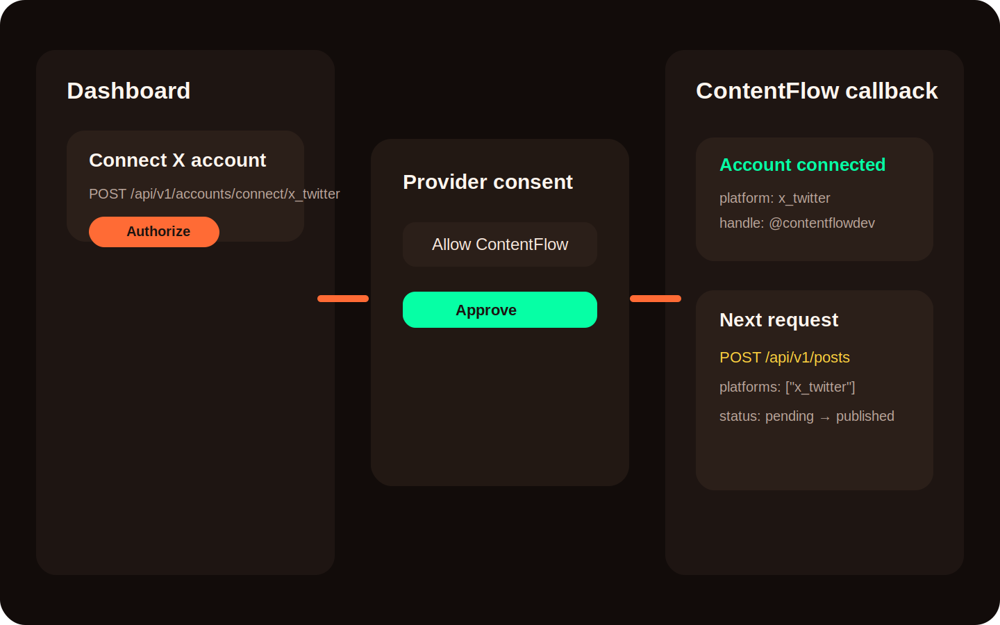

# Quickstart

This path assumes you want the fastest route to a successful first publish.

## 1. Create your account

Create an account in the dashboard, then open the API key screen and issue your first key.



You only need three things before the first request:

- A ContentFlow account
- An API key beginning with `cf_live_` or `cf_test_`
- At least one connected social account

## 2. Install an SDK

<CodeGroup>

```python Python
pip install contentflow
```

```javascript JavaScript
npm install contentflow-sdk
```

```go Go
go get github.com/ansdnwls/content-flow/sdk/go
```

</CodeGroup>

## 3. Connect one platform with OAuth

Start with a platform that supports first-party OAuth in the current API: `youtube`, `instagram`, `facebook`, `threads`, `tiktok`, or `x_twitter`.

```bash
curl -X POST https://contentflow-api.railway.app/api/v1/accounts/connect/x_twitter \
  -H "X-API-Key: cf_live_replace_me"
```

The response contains an `authorize_url`. Redirect the user there, complete consent, and then let ContentFlow handle the callback.



## 4. Publish your first post

<CodeGroup>

```python Python
from contentflow import ContentFlow

cf = ContentFlow(api_key="cf_live_replace_me")

post = cf.posts.create(
    text="Shipping the new launch clip across X today.",
    platforms=["x_twitter"],
    media_type="text",
)

print(post["id"], post["status"])
```

```javascript JavaScript
import { ContentFlow } from "contentflow-sdk";

const cf = new ContentFlow({ apiKey: "cf_live_replace_me" });

const post = await cf.posts.create({
  text: "Shipping the new launch clip across X today.",
  platforms: ["x_twitter"],
  mediaType: "text",
});

console.log(post.id, post.status);
```

```go Go
package main

import (
  "context"
  "fmt"
  "log"

  cf "github.com/ansdnwls/content-flow/sdk/go/contentflow"
)

func main() {
  client := cf.New("cf_live_replace_me")
  text := "Shipping the new launch clip across X today."

  post, err := client.Posts.Create(context.Background(), &cf.CreatePostRequest{
    Text:      &text,
    Platforms: []string{"x_twitter"},
    MediaType: "text",
  })
  if err != nil {
    log.Fatal(err)
  }

  fmt.Println(post.ID, post.Status)
}
```

</CodeGroup>

## 5. Check delivery status

```bash
curl https://contentflow-api.railway.app/api/v1/posts/{post_id} \
  -H "X-API-Key: cf_live_replace_me"
```

You are done once the aggregate post status and the per-platform status both move out of `pending`.

## Common first-run issues

- `401 Unauthorized`: the `X-API-Key` header is missing, expired, or revoked.
- `missing_accounts` in dry-run: the post references a platform that does not have a connected account yet.
- `409 Conflict` on cancel or replay flows: the resource has already moved past the allowed state transition.
- Empty account list: OAuth succeeded at the provider, but your app never received the callback URL.

## Next steps

- Read [Authentication](/authentication) for rotation and environment handling.
- Use [First post](/guides/first-post) for richer payloads and scheduling.
- Open [API Reference](/api-reference/overview) when you want exact schemas.
